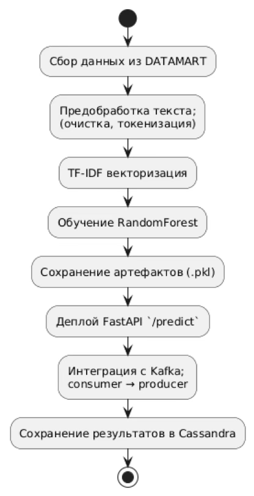
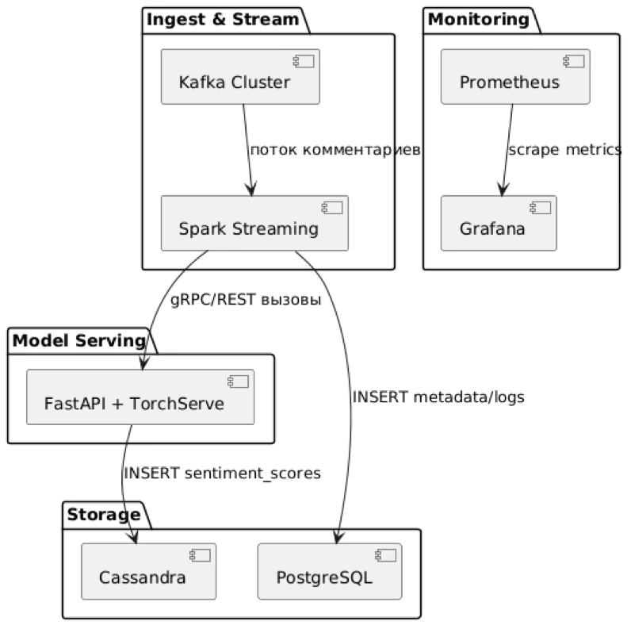
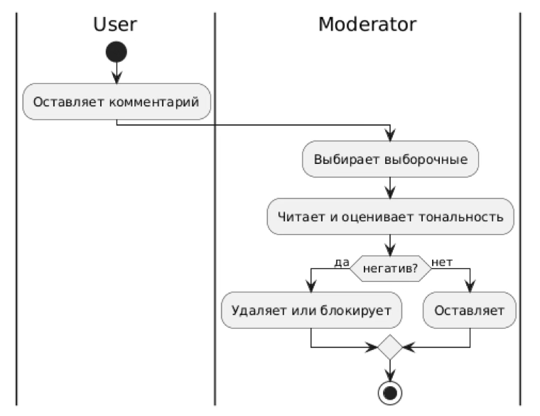
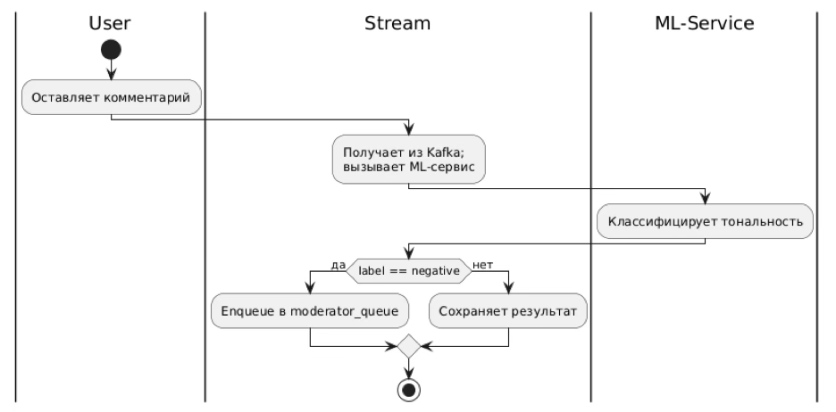
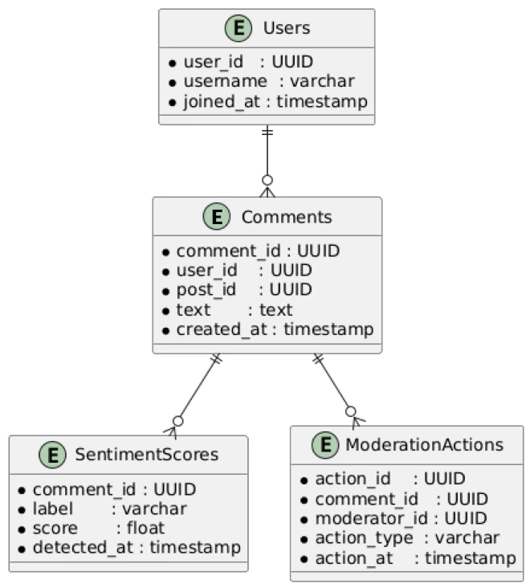
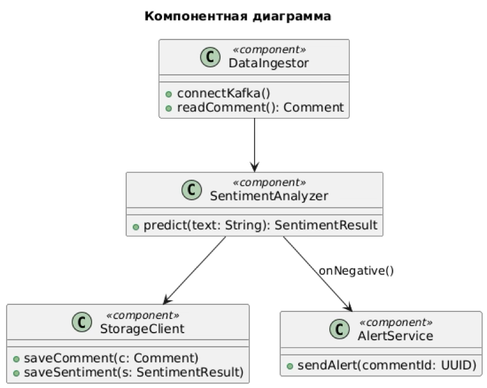
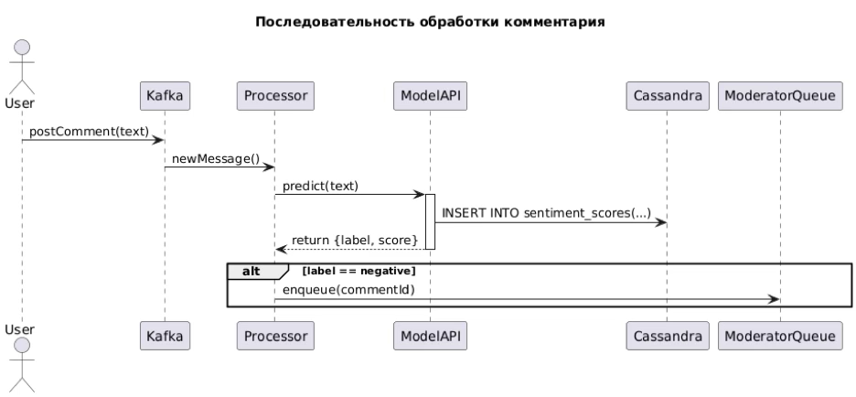

# Project Task
Проектное задание: командное проектирование информационной системы с ИИ-начинкой

# Название проекта

**ML-система анализа тональности пользовательских комментариев в социальной сети**

---

## Название кейса

**Кейс №1: Автоматизация мониторинга пользовательских реакций на контент в социальной сети**

---

## Команда проекта

| Участник            | Роль(и)                                                          |
|---------------------|------------------------------------------------------------------|
| Екатерина Лапшина   | Product Owner, Data Scientist, Software Architect, Data Engineer |
    
> ## Термины и пояснения
> - Итерация - это все работы, которые совершаются до старта очередного пилота  
> - БТ - бизнес-требования
> - ML - машинное обучение

# 1. Цели и предпосылки

## 1.1. Зачем идём в разработку продукта?
Социальная сеть ежедневно обрабатывает до **500 000 пользовательских комментариев**, однако существующая система ручной модерации охватывает лишь небольшую часть этого объёма. Это приводит к тому, что **токсичные или потенциально опасные сообщения остаются без внимания в течение нескольких часов**. Такая задержка в реагировании создаёт существенные **репутационные риски**: пользователи сталкиваются с негативным контентом, что снижает доверие к платформе. Дополнительно, в условиях жёсткого регулирования со стороны государственных органов (в частности, **Роскомнадзора**) наличие непроверенного или запрещённого контента может повлечь за собой **штрафы, предписания или блокировки ресурса**. Всё это делает ручную модерацию неэффективной и требует внедрения **масштабируемого автоматизированного решения**.

### 1. Бизнес-цель (Product Owner):
Целью проекта является **разработка программного продукта**, способного автоматически анализировать тональность каждого поступающего комментария в социальной сети. Основное внимание уделяется выявлению так называемого **«тяжёлого негатива»** — сообщений, содержащих оскорбления, угрозы, проявления агрессии или иные формы токсичного поведения. В случае обнаружения такого контента система должна **в режиме реального времени классифицировать сообщение** и **помещать его в приоритетную очередь модерации**.

Это позволит оперативно фокусировать внимание модераторов на действительно критичных инцидентах, **сократив время реакции и повысив эффективность ручной проверки**, при этом значительно снизив общий объём контента, требующего оценки вручную.

### 2. Почему станет лучше с ML (Product Owner & Data Scientist):
В отличие от ручной модерации, которая ограничена человеческим ресурсом и подвержена субъективным колебаниям, **модель машинного обучения (ML)** обеспечивает **непрерывную и стабильную обработку всего входящего потока комментариев**. Она работает 24/7, не требует отдыха и демонстрирует **единообразие в принятии решений**, исключая человеческий фактор.

Благодаря высокой скорости обработки и отсутствию задержек, связанных с очередностью и загрузкой персонала, такая модель **существенно сокращает время реакции** — вместо нескольких часов, необходимых на ручной просмотр, решение о потенциально негативном сообщении может быть принято **в течение нескольких секунд или минут** после его публикации. Это критически важно для поддержания здоровой коммуникационной среды и своевременного реагирования на агрессивный или запрещённый контент.

### 3. Что считаем успехом итерации с точки зрения бизнеса (Product Owner):

Для оценки эффективности первой итерации (MVP) с точки зрения бизнес-целей мы выделяем следующие **ключевые метрики успеха**:

- **Среднее время реакции на «критический негатив» должно быть менее 5 минут**. Это означает, что от момента публикации до попадания комментария в приоритетную очередь модерации и его рассмотрения должно проходить не более нескольких минут. Такая скорость позволяет своевременно блокировать острые негативные сообщения до того, как они успеют нанести вред репутации платформы.

- **Recall (полнота) для класса «негатив» не ниже 90 %**. Модель должна уметь находить подавляющее большинство действительно негативных комментариев. Это критично для того, чтобы не пропускать токсичный или запрещённый контент.

- **Precision (точность) для класса «негатив» не ниже 80 %**. Высокая точность необходима, чтобы избежать чрезмерного количества ложных срабатываний и не загружать модераторов неактуальными сообщениями.

Достижение этих показателей подтвердит, что система не только технологически работоспособна, но и **реально приносит бизнес-ценность**, улучшая пользовательский опыт и снижая регуляторные риски.

## 1.2. Бизнес-требования и ограничения

### 1. Краткое описание БТ

Система должна соответствовать следующим **базовым бизнес-требованиям (БТ)**, определяющим её функциональность и технические характеристики:

- **Обработка до 500 000 комментариев в сутки.** Решение должно быть способно обрабатывать весь поток пользовательских сообщений в социальной сети без выборочной фильтрации, обеспечивая полноту охвата.

- **API-классификатор с задержкой на 95-м процентиле (p95 latency) не более 200 мс.** Это условие критично для интеграции системы в реальном времени: прогноз по каждому комментарию должен возвращаться достаточно быстро, чтобы не ухудшать пользовательский опыт.

- **Интеграция через Kafka.** Архитектура решения предполагает использование Kafka в качестве основного механизма передачи событий. Комментарии поступают в топик `comments`, а результаты анализа направляются в `moderator_queue`, что позволяет легко встроить систему в существующий пайплайн обработки данных.

- **Хранение в Cassandra.** Для обеспечения высокой скорости записи и масштабируемости система хранения результатов предсказаний должна использовать **распределённую NoSQL-базу Cassandra**, которая хорошо подходит для задач с высоким потоком данных и доступом в режиме реального времени.

### 2. Бизнес-ограничения (Product Owner)

В рамках реализации проекта необходимо учитывать ряд **бизнес-ограничений**, определяющих допустимые рамки архитектурных и технологических решений:

- **Бюджет на облачные ресурсы не должен превышать $10 000 в месяц.** Это ограничение задаёт экономическую планку, в рамках которой должны быть реализованы все вычисления, хранение данных, масштабирование и мониторинг. Решение должно быть не только эффективным, но и экономически оправданным.

- **Автоматизированные блокировки недопустимы.** Система не должна автоматически удалять или скрывать пользовательские комментарии без подтверждения со стороны модератора. Даже при высокой точности модели важно сохранять баланс между автоматизацией и контролем — особенно в пограничных случаях, где необходима человеческая интерпретация.

- **Полное соответствие требованиям GDPR и ФЗ-152.** Все операции с пользовательскими данными должны соответствовать законодательству в области персональных данных. Это включает в себя:
  - шифрование данных при передаче и хранении (at-rest и in-transit),
  - ведение журнала доступа (аудит),
  - реализацию механизмов RBAC (ролевого доступа).

### 3. Ожидания от итерации (Product Owner)

В рамках текущей итерации (MVP) ожидается достижение **минимально жизнеспособного результата**, позволяющего протестировать ключевые гипотезы и подтвердить работоспособность всей цепочки обработки данных:

- **Рабочий пайплайн Kafka → модель → очередь.** Система должна принимать комментарии из Kafka-топика (`comments`), передавать их в модель машинного обучения для анализа тональности, а затем — по результатам классификации — направлять ID сообщений с высокой вероятностью негативного контента в приоритетную `moderator_queue`. Важно, чтобы этот процесс был автоматическим, устойчивым и воспроизводимым.

- **Простой дашборд в Prometheus/Grafana.** Для базового мониторинга качества работы системы необходимо развернуть панель с отображением ключевых метрик. Такой дашборд даст возможность **оперативно отслеживать поведение модели** и принимать решения о корректировках на следующих этапах.

### 4. Бизнес-процесс пилота

Пилотный запуск модели внедряется **без вмешательства в текущую логику публикации** и основывается на параллельной обработке потока комментариев. Это позволяет протестировать модель в условиях, максимально приближенных к рабочим, не затрагивая пользовательский опыт. Процесс выглядит следующим образом:

- **a) Все новые комментарии публикуются как обычно.** Пользователь не замечает изменений — система продолжает функционировать в стандартном режиме, без задержек и фильтрации на этапе публикации.

- **b) Параллельно ML-сервис получает копии сообщений из Kafka-топика `comments`.** Комментарии дублируются и передаются в ML-компоненту для анализа тональности, без влияния на скорость отображения на платформе.

- **c) Если комментарий классифицирован как `label=negative` и модель присвоила ему `score ≥ 0.8`, его ID автоматически отправляется в Kafka-топик `moderator_queue`.** Таким образом, приоритетная очередь пополняется только сообщениями, вызывающими обоснованное беспокойство с точки зрения токсичности.

- **d) Модераторы в пилоте получают доступ к этой приоритетной очереди и оценивают скорость обработки, релевантность классификации и общий уровень доверия к системе.** Их обратная связь будет ключевой для корректировки бизнес-правил и параметров модели на следующем этапе развития проекта.

### 5. Критерии успешного пилота (Product Owner)

Для признания пилотного запуска успешным определены следующие **ключевые бизнес-метрики и качественные показатели**, отражающие как точность модели, так и её влияние на рабочие процессы:

- **Recall ≥ 90 %.** Модель должна корректно идентифицировать как можно больше действительно негативных комментариев. Высокая полнота (recall) особенно важна в условиях, где пропуск токсичных сообщений может повлечь за собой репутационные и юридические последствия.

- **Precision ≥ 80 %.** Наряду с высокой чувствительностью важно сохранять точность: значительная часть сообщений, классифицированных как негативные, действительно должны представлять собой угрозу. Это минимизирует перегрузку модераторов ложными срабатываниями.

- **Снижение среднего времени модерации «критических» комментариев на 80 %.** За счёт выделения приоритетной очереди негативных сообщений модераторы смогут сосредоточиться на действительно важных кейсах и обрабатывать их быстрее, чем при полном ручном просмотре.

- **Положительная обратная связь от команды модерации.** Помимо количественных метрик, большое значение имеет восприятие модели самими модераторами. Если система воспринимается как полезная, точная и помогающая в работе — это прямое подтверждение её эффективности и готовности к дальнейшему внедрению.

## 1.3. Scope проекта/итерации

### Входит (Data Scientist):

Данный этап охватывает базовую реализацию MVP, позволяющую протестировать ключевую гипотезу проекта и оценить работоспособность всей цепочки:

1. **Синтетическая и историческая выборка → CSV.** Для обучения модели используется комбинация реальных комментариев с ручной разметкой и синтетически сгенерированных примеров. Все данные агрегируются в формате CSV для последующей обработки.

2. **Baseline-модель: TF-IDF + RandomForest.** В качестве быстрого и интерпретируемого решения на старте выбран классический пайплайн — векторизация текста методом TF-IDF и классификация при помощи RandomForest. Такой подход обеспечивает хорошее качество на старте и высокую скорость обучения.

3. **FastAPI /predict + TestClient.** Для обеспечения доступа к модели разворачивается API-сервис на FastAPI с предсказанием по endpoint `/predict` и тестовой обвязкой для проверки корректности работы.

4. **Kafka consumer/producer (топик `comments` → `moderator_queue`).** Реализована потоковая обработка сообщений: consumer считывает комментарии из топика `comments`, модель выполняет анализ, и producer отправляет результат (ID негативного комментария) в `moderator_queue`.

5. **Запись в Cassandra (с fallback).** Предсказания модели сохраняются в базу Cassandra для последующего анализа и мониторинга. В случае сбоев реализован fallback-механизм, обеспечивающий отказоустойчивость.

---

### Не входит (Data Scientist):

Следующие компоненты и возможности находятся за пределами текущей итерации и не реализуются в рамках MVP:

- **Финетюнинг трансформеров (BERT).** Использование сложных нейросетевых моделей требует значительных вычислительных ресурсов и будет отложено до следующих этапов.

- **Онлайн переобучение, Drift Detection.** Обнаружение дрейфа данных и автоматическое переобучение пока не внедряется — решение работает в офлайн-режиме.

- **Полнофункциональный UI-дашборд.** Интерфейс для визуального управления и анализа метрик будет реализован позднее. В MVP ограничиваемся дашбордом Prometheus/Grafana.

- **Поддержка мультиязычности за пределами RU/EN.** На старте проект ориентирован только на русскоязычные и англоязычные комментарии.

---

### Качество кода и воспроизводимость (Data Scientist):

- **Каждый этап работы оформлен как ячейка в Google Colab.** Это позволяет легко воспроизвести весь процесс обучения и инференса.

- **`requirements.txt` фиксирует зависимости.** Указание всех библиотек и их версий обеспечивает стабильность среды при повторных запусках.

- **Модель и векторизатор сохраняются в `.pkl`.** Это гарантирует идентичность результатов при последующих предсказаниях и облегчает развёртывание.

---

### Технический долг (Data Scientist):

Несмотря на готовность MVP, ряд аспектов остаются в техническом долге и будут реализованы в будущем:

- **CI/CD с Docker и Kubernetes.** Для полноценной автоматизации сборки и развёртывания компонентов модели.

- **Логирование экспериментов (MLflow).** Хранение информации о конфигурациях, метриках и артефактах экспериментов.

- **Расширение до AutoML и Deep NLP.** Использование более сложных подходов для повышения точности и масштабируемости модели.

## 1.4. Предпосылки решения (Data Scientist)

Для построения и корректной работы модели машинного обучения приняты следующие **ключевые допущения**, определяющие структуру данных и подход к прогнозированию:

- **Источники данных: история разметки модераторов, Kafka-топики.** Основу обучающей выборки составляют комментарии, ранее размеченные вручную модераторами (с присвоением меток тональности). В процессе работы модели в продакшене предполагается получение новых сообщений через Kafka-топики в реальном времени.

- **Гранулярность: единица анализа — один комментарий.** Модель принимает решение на уровне отдельного сообщения, без учёта контекста обсуждения или предыдущих реплик. Это позволяет упростить обработку и обеспечить стабильную производительность.

- **Горизонт прогноза: мгновенный ответ при публикации.** Система должна возвращать результат классификации сразу после получения комментария, не откладывая обработку и не требуя дополнительного накопления контекста или пакетной обработки.

- **Бизнес-логика: классы `negative / neutral / positive`, плюс числовой `score` для определения порога (threshold).** Комментарии классифицируются по трем основным категориям, а также снабжаются числовой оценкой уверенности модели (`score`). Эта оценка используется для принятия решения — например, отправки в модераторскую очередь только тех сообщений, где `label=negative` и `score ≥ 0.8`.

# 2. Методология

## 2.1. Постановка задачи (Data Scientist)

С технической точки зрения перед нами стоит задача **многоклассовой классификации текстов**, где каждый входной комментарий должен быть отнесён к одной из категорий: `positive`, `neutral` или `negative`. Ключевая цель — автоматизировать этот процесс для обработки больших объёмов пользовательских сообщений в реальном времени.

В качестве базовой модели (baseline) выбрано **сочетание TF-IDF векторизации и алгоритма RandomForestClassifier**. Это решение обладает рядом преимуществ:

- **Простота реализации и интерпретации.** Подход легко воспроизводим, хорошо документирован и позволяет быстро получить рабочий прототип.
- **Скорость обучения и предсказания.** TF-IDF и RandomForest хорошо масштабируются и подходят для использования в системах с высокой нагрузкой.
- **Отсутствие необходимости в больших вычислительных ресурсах.** По сравнению с нейросетевыми архитектурами, данная связка менее требовательна и позволяет запускать модель даже на одном CPU-сервере.

Данный baseline используется как отправная точка для пилота, на основании которого можно будет сравнивать будущие улучшения и более сложные модели.

## 2.2. Блок-схема решения (Data Scientist)

## 2.3. Этапы решения задачи (Data Scientist)

| Этап                 | Вводные                 | Техника                       | Выход                         |
|----------------------|--------------------------|-------------------------------|-------------------------------|
| 1. Подготовка данных | Исторические комментарии | Синтетика + CSV               | labeled_comments.csv          |
| 2. Baseline-модель   | CSV                      | TF-IDF + RandomForest         | model_rf.pkl, tfidf.pkl       |
| 3. Бизнес-правила    | label+score              | Threshold >= 0.8              | Enqueue logic                 |
| 4. Инференс          | FastAPI                  | REST /predict                 | JSON-ответ                    |
| 5. Потоковая обработка | KafkaConsumer          | Producer в moderator_queue    | Очередь модерации             |
| 6. Отчётность        | Prometheus/Grafana       |                               | Дашборды, метрики latency/recall |

# 3. Подготовка пилота

## 3.1. Способ оценки (Product Owner, Data Scientist)

Для объективной оценки эффективности внедряемой ML-системы будет проведено **A/B-тестирование**, в рамках которого сравниваются два подхода к модерации:

- **A-группа (контроль):** комментарии обрабатываются исключительно вручную, как это происходит в текущем процессе.
- **B-группа (эксперимент):** комментарии дополнительно анализируются ML-моделью, которая формирует приоритетную очередь сообщений с высокой вероятностью негативной тональности.

Обе группы функционируют параллельно в реальном времени, без влияния на пользовательский опыт. Модераторы, работающие с B-группой, получают возможность быстрее реагировать на наиболее критичные сообщения.

**Ключевые показатели для сравнения:**
- **Среднее время реакции** на негативные комментарии;
- **Количество пропущенных токсичных сообщений** (false negatives);
- **Нагрузка на модераторов**;
- **Общее количество обработанных сообщений.**

Результаты теста позволят оценить, насколько ML-система способствует ускорению процесса модерации и повышению её эффективности по сравнению с полностью ручным подходом.

## 3.2. Успешный пилот (Product Owner)

Пилотный запуск считается успешным, если достигаются следующие **ключевые метрики качества и производительности**, напрямую связанные с бизнес-целями проекта:

- **Recall ≥ 90 %.** Система должна успешно обнаруживать не менее 90 % всех действительно негативных комментариев. Высокая полнота критична для минимизации пропуска токсичного контента, который может нанести вред пользователям или репутации платформы.

- **Precision ≥ 80 %.** Не менее 80 % комментариев, классифицированных как негативные, действительно должны соответствовать этой категории. Это позволяет избежать чрезмерной нагрузки на модераторов из-за ложных срабатываний.

- **latency p95 ≤ 200 ms.** Сервис классификации должен обеспечивать прогнозы с задержкой не более 200 миллисекунд для 95 % запросов. Это важно для того, чтобы не нарушать поток публикации сообщений и сохранять высокую отзывчивость системы.

- **Среднее время модерации «тяжёлого негатива» снижено до 5 минут или менее.** Благодаря приоритетной очереди модерации и автоматическому выявлению острых кейсов, реакции на такие комментарии должны стать существенно быстрее по сравнению с текущим ручным процессом.

Достижение этих показателей продемонстрирует, что система не только технически работоспособна, но и приносит реальную пользу в бизнес-контексте — улучшая безопасность, снижая репутационные риски и оптимизируя ресурсы модерации.

## 3.3. Подготовка пилота (Data Scientist)

Перед запуском пилота необходимо провести техническую подготовку, направленную на обеспечение стабильности и предсказуемой производительности модели в условиях боевой нагрузки. Ключевые мероприятия включают:

- **Оценка вычислительных затрат: 1000 req/s на одном CPU-виртуалке.** Проводится нагрузочное тестирование модели на стандартной виртуальной машине с одним CPU. Цель — убедиться, что решение способно обрабатывать до 1000 запросов в секунду без деградации качества сервиса и превышения порогов задержки.

- **Ограничение параметра `n_estimators` для повышения скорости.** Количество деревьев в модели `RandomForestClassifier` (параметр `n_estimators`) подбирается с учётом компромисса между точностью и временем отклика. Снижение этого параметра позволяет значительно ускорить предсказание без критического ухудшения метрик качества.

- **Настройка мониторинга загрузки и алертов.** Для обеспечения прозрачности и устойчивости работы в процессе пилота настраиваются метрики загрузки ресурсов (CPU, память, задержки) и соответствующие алерты. Это позволяет оперативно выявлять и устранять узкие места, а также гарантировать соответствие SLA в условиях реального трафика.

# 4. Внедрение в production

## 4.1. Архитектура решения

## 4.2. Инфраструктура и масштабируемость

Проект предусматривает использование современной облачной инфраструктуры, обеспечивающей как устойчивость, так и возможность горизонтального масштабирования под высокую нагрузку. Ключевые компоненты и механизмы масштабируемости включают:

- **Kubernetes (авто-скейлинг, rolling updates).** Контейнеризация компонентов и их управление через Kubernetes обеспечивает гибкость развертывания, отказоустойчивость и автоматическое масштабирование под текущую нагрузку. Rolling updates позволяют обновлять компоненты без прерывания сервиса, что особенно важно для production-среды.

- **Kafka (многоброкерная топология).** Kafka используется как основной механизм передачи и буферизации сообщений. Для обеспечения высокой доступности и производительности применяется конфигурация с несколькими брокерами и партициями, что позволяет равномерно распределять нагрузку и обрабатывать поток комментариев с минимальной задержкой.

- **TorchServe Pods (горизонтальное масштабирование).** Компонент, отвечающий за инференс модели, разворачивается в виде нескольких независимых подов TorchServe. Это позволяет масштабировать обработку предсказаний в зависимости от RPS (запросов в секунду), сохраняя целевые показатели по latency даже при пиковых нагрузках.

Такой подход обеспечивает масштабируемость системы «по требованию» и позволяет плавно перейти от MVP к полноценному production-развёртыванию с поддержкой многомиллионной аудитории.

## 4.3. Требования к работе системы

Система должна соответствовать ряду строгих требований по производительности и доступности, чтобы эффективно функционировать в условиях высокой нагрузки и обеспечивать стабильную работу в реальном времени:

- **Пропускная способность до 6000 RPS (requests per second).** Решение должно быть способно обрабатывать до 6000 входящих комментариев в секунду. Это необходимо для покрытия пиковых нагрузок, особенно в часы максимальной активности пользователей.

- **Задержка на 95-м процентиле (p95 latency) не более 200 мс.** Большинство запросов (не менее 95 %) должны обрабатываться системой менее чем за 200 миллисекунд. Это критично для обеспечения плавного пользовательского опыта и своевременной фильтрации нежелательного контента.

- **Доступность системы (uptime) не ниже 99.9 %.** Высокий уровень доступности означает, что система может находиться в нерабочем состоянии не более ~40 минут в месяц. Это достигается за счёт распределённой архитектуры, резервирования компонентов и автоматического восстановления при сбоях.

Выполнение этих требований обеспечивает соответствие ожиданиям бизнеса и готовность системы к эксплуатации в условиях высокой интенсивности и регуляторного давления.

## 4.4. Безопасность системы

Обеспечение безопасности является критически важным аспектом при внедрении автоматизированной системы модерации, особенно в условиях обработки пользовательского контента и взаимодействия с персональными данными. В рамках архитектуры предусмотрены следующие меры защиты:

- **TLS everywhere.** Все сетевые соединения внутри и вне кластера защищены с помощью протокола TLS (Transport Layer Security), что гарантирует конфиденциальность и целостность передаваемых данных. Это распространяется как на HTTP(S)-запросы к API, так и на внутренние взаимодействия между сервисами (Kafka, Cassandra, модель).

- **RBAC (Role-Based Access Control).** Контроль доступа реализован на основе ролей: каждому компоненту и пользователю системы назначаются минимально необходимые права. Это снижает риск несанкционированного доступа к данным и внутренним сервисам.

- **Аудит логирование.** Все действия пользователей и системных компонентов, связанные с доступом к данным, запросами к модели и модификациями конфигурации, записываются в журналы аудита. Это позволяет проводить ретроспективный анализ, выявлять нарушения политики безопасности и отслеживать инциденты.

Такая архитектура безопасности обеспечивает соответствие лучшим практикам DevSecOps и требованиям законодательства, включая GDPR и ФЗ-152.

## 4.5. Безопасность данных

В рамках проекта реализуются следующие меры для обеспечения безопасности данных:

- **Соответствие требованиям GDPR и ФЗ-152.** Все процессы сбора, хранения и обработки данных строятся с учётом норм европейского регламента по защите персональных данных (GDPR) и российского закона № 152-ФЗ. Это включает принципы минимизации данных, прозрачности обработки, ограниченного доступа и защиты прав субъектов данных.

- **Шифрование данных при хранении (at-rest) и передаче (in-transit).**  
  - **At-rest:** Все данные, хранящиеся в базах (Cassandra, PostgreSQL), зашифрованы с использованием современных алгоритмов (например, AES-256), что исключает возможность их утечки при компрометации хранилища.
  - **In-transit:** Все коммуникации между компонентами системы, а также между клиентами и API, защищены TLS/HTTPS, что предотвращает перехват или подмену данных при передаче.

Эти меры позволяют не только соответствовать требованиям регуляторов, но и обеспечивать высокий уровень доверия пользователей к платформе.

## 4.6. Издержки

Ориентировочная стоимость эксплуатации системы в боевом режиме составляет **от 700 000 до 900 000 рублей в месяц**, в зависимости от интенсивности нагрузки и выбранных параметров масштабирования. В оценку включены следующие основные категории расходов:

- **Облачные вычислительные ресурсы.** Включают оплату виртуальных машин (в т.ч. с GPU при использовании продвинутых моделей), автоматическое масштабирование под нагрузку, а также ресурсы для хранения и обработки данных (Kafka, Cassandra, PostgreSQL).

- **Сетевые ресурсы и балансировщики.** Стоимость входящего/исходящего трафика, использование защищённых прокси и балансировщиков нагрузки (например, ingress-контроллеров в Kubernetes).

- **Хранилища и бэкапы.** Расходы на долговременное хранение данных классификации, журналов, а также резервные копии, необходимые для отказоустойчивости и восстановления после сбоев.

- **Мониторинг и логирование.** Использование решений для сбора метрик и логов (например, Prometheus, Grafana, Loki), включая их хостинг и хранение истории.

Данный уровень затрат оправдан масштабом задачи и требованиями к доступности, скорости и безопасности. При необходимости проект может быть оптимизирован за счёт масштабирования по расписанию или миграции части компонентов в более экономичные среды.

## 4.7. Integration points

Для обеспечения гибкой и масштабируемой интеграции с другими компонентами платформы, а также внешними сервисами, система предоставляет следующие ключевые точки подключения (integration points):

- **Kafka REST Proxy.** Используется для взаимодействия с потоковой системой обмена сообщениями Kafka через HTTP-интерфейс. Это позволяет сторонним сервисам публиковать и считывать сообщения (например, новые комментарии или результаты классификации) без необходимости прямого подключения к Kafka-кластерам. Такой подход облегчает интеграцию и повышает безопасность, изолируя внутреннюю архитектуру от внешнего доступа.

- **FastAPI `/predict`.** RESTful API endpoint, через который осуществляется обращение к модели машинного обучения для получения предсказания тональности комментария. Сервис принимает текст на вход и возвращает метку (`positive`, `neutral`, `negative`) с вероятностью (`score`). Этот интерфейс используется как внутри системы (например, в стриминговом пайплайне), так и может быть вызван вручную для целей тестирования или отладки.

Обе точки интеграции поддерживают масштабирование и могут быть использованы для построения гибкой архитектуры, совместимой с микросервисным подходом.

## 4.8. Риски

При внедрении и эксплуатации ML-системы в продуктивной среде необходимо учитывать потенциальные риски, способные повлиять на стабильность работы и качество предсказаний. Основные риски и меры по их снижению включают:

- **Data drift → план переобучения.**  
  Со временем может происходить **дрейф данных** — изменение лексики, пользовательского поведения или стиля общения, что приводит к снижению качества модели, обученной на исторических данных. Чтобы минимизировать последствия этого эффекта, необходимо внедрить **регулярный процесс переобучения модели** на актуальных данных (например, с периодичностью 1 раз в месяц), а также настроить мониторинг распределений входных признаков и предсказаний (drift-detection).

- **Пиковые нагрузки → capacity planning.**  
  В периоды активности (например, при публикации резонансных постов) объём входящих комментариев может значительно превышать средние показатели. Без должного планирования это способно привести к превышению лимитов по RPS и росту задержек. Для предотвращения таких ситуаций реализуется **capacity planning** — оценка и резервирование ресурсов с учётом пиковых сценариев, а также использование **автоматического масштабирования** компонентов (модели, брокеров Kafka, API-сервисов).

Адекватное управление этими рисками критически важно для поддержания надёжности и доверия к системе в долгосрочной перспективе.

# 5. Схемы

## 5.1. BPMN: текущий процесс

## 5.2. BPMN: после внедрения

## 5.3. ER-диаграмма

## 5.4. Компонентная UML-диаграмма

## 5.5. Диаграмма последовательности

